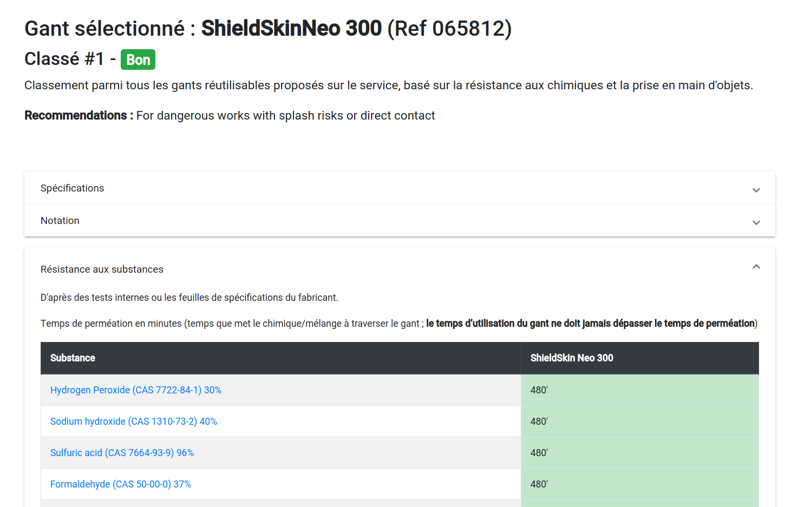

\newpage
# Guide de l'utilisateur

## Généralités

Le **Guide des gants EPFL** est une application qui vous aide à choisir le bon gant pour travailler avec un ou plusieurs produit(s) chimique(s). 
Cette application vous permet de :

* Rechercher une substance et consulter la résistance des différents gants proposés à l'EPFL contre cette substance
* Rechercher un gant et consulter ses caractéristiques ainsi que la résistance de ce gant contre certaines substances
* Rechercher quels matériaux de gants (et donc quels gants) sont les plus adaptés pour travailler avec un mélange de substances (grâce à l'outil ProtecPo de l'INRS)

Le site est disponible en deux langues : l'anglais, par défaut, et le français.

Vous pouvez accéder à cette application depuis le réseau EPFL via le lien suivant : [http://sbvm0028.xaas.epfl.ch/](http://sbvm0028.xaas.epfl.ch/)

## Mise en garde

Lorsque vous ouvrez l'application, une mise en garde s'affichera. Nous la reproduisons ici :

> Cet outil aggrège des données depuis des sources multiples pour vous aider à prendre la meilleure décision lors du choix des gants à utiliser pour manipuler des produits chimiques. Comme tout programme informatique, ce guide peut contenir des bugs ou des données incorrectes. Nous ne prendrons aucune responsabilité pour tout dégât que cet outil pourrait indirectement causer.

> Ce site utilise des données de l'outil ProtecPo de l'INRS qui dispose de sa propre mise en garde, reproduite ici :
 
> **Mise en garde ProtecPo :** ProtecPo est un outil d’aide au choix de la sélection de vos matériaux polymères de protection cutanée aux substances. Les résultats ont un caractère prédictif. Ils sont basés sur une modélisation des interactions entre substances chimiques et matériau polymère établie à partir de la théorie tridimensionnelle de solubilité. L’algorithme de sélection de ProtecPo est robuste, enrichi et validé par de nombreuses données physico-chimiques et empiriques. Toutefois, **une erreur de sélection par l’algorithme du logiciel reste possible.** Les recommandations de ProtecPo sont à considérer comme une première sélection de matériaux polymères pour vous orienter vers des protections cutanées résistantes aux substances chimiques. ProtecPo ne prend pas en compte les conditions réelles d’utilisation des produits et des protections, et les conséquences de leur contact avec la peau (exemple : allergie aux protéines du latex ou additifs dans les polymères). Ainsi, les recommandations de ProtecPo ne se substituent en aucun cas aux tests de performance de vos matériaux de protection et à l’avis des professionnels de santé et de sécurité.

> **Votre protection doit être changée immédiatement et impérativement dès qu’un contact avec un produit chimique a eu lieu, en particulier lors d’utilisation de fines protections jetables.**

Il est important de garder en tête que les prédictions faites par l'application ne sont qu'un outil parmi d'autres pour choisir la protection la plus adaptée. Vous pouvez changer la langue d'affichage de l'application (et de la mise en garde) en cliquant sur **EN** ou **FR** en haut à droite de la boite de dialogue.

\newpage
## Interface utilisateur

La Figure 1 présente la page d'accueil du site. Voici les éléments que vous trouverez sur cette page :

1. L'outil de sélection de langue. Cliquez sur EN pour passer en anglais, ou FR pour passer en français.
2. Le nom du site. Cliquez sur ce titre pour revenir à tout moment sur la page d'accueil.
3. La barre de recherche. Elle vous permet de rechercher un gant ou une substance, voir la section [barre de recherche](#barre-de-recherche)
4. La page d'accueil. Elle contient quelques liens utiles:
   - Un lien vers une vidéo montrant comment retirer une paire de gants correctement
   - Un lien vers la liste de tous les gants répertoriés dans l'application
5. L'outil de protection contre les mélanges. Il vous permet de rentrer un mélange chimique pour obtenir une recommendation de gants. La section [Protection contre les mélanges](#melanges) contient un guide détaillé de cette fonctionnalité.

Les trois premiers éléments sont présents sur toutes les pages du site.

### Barre de recherche {#barre-de-recherche}

La barre de recherche vous permet de rechercher une substance ou un gant pour obtenir plus d'informations. Elle fonctionne principalement avec de **l'autocomplétion**. Cela signifie qu'il vous suffit de taper les premiers caractères de votre recherche, puis de cliquer directement sur le résultat pour l'afficher. Vous serez alors dirigé vers la [page de substance](#substance).

Pour chaque substance, la liste déroulante affiche le **nom en anglais**, à gauche, et le **numéro CAS**, à droite. Il est possible de rechercher à la fois par nom et par numéro CAS.

Pour rechercher un gant, vous disposez de plusieurs options :

- Si vous connaissez le nom ou le numéro de série du gant, vous pouvez simplement l'indiquer dans la barre de recherche et cliquer sur le résultat correct. 
- Vous pouvez choisir de ne chercher que parmi les gants en commençant votre recherche par `glove:`. Par exemple, rechercher `glove:Microflex` n'affichera que les gants de marque Microflex.
- Vous pouvez également rechercher des gants par matériau. Indiquer `glove:Nitrile` n'affichera donc que les gants en nitrile.
- Enfin, vous pouvez afficher l'intégralité des gants en tapant simplement `glove` dans le champ de recherche.

Pour chaque gant, la liste déroulante affiche la marque et le nom du produit à gauche, les matériaux et la référence à droite. Là encore, il vous suffit de cliquer sur le résultat lorsque vous l'avez repéré pour être redirigé vers la [page du gant](#glove).

Si ce que vous recherchez n'apparait pas dans le menu déroulant, vous pouvez lancer une recherche en appuyant sur la touche "entrée" de votre clavier, ou en cliquant sur la loupe. Attention cependant, **la recherche ne fonctionne que pour les substances chimiques**. Aucun gant ne sera affiché de cette manière.

### Page de substance {#substance}

La page de substance vous permet d'obtenir les temps de perméation d'une substance avec les gants du système. Attention, nous ne disposons pas de ces informations pour toutes les substances.

Le titre de la page vous rappelle **le nom de la substance (en anglais)** ainsi que son **numéro CAS**. 

Le bouton "Ajouter au mélange" vous permet d'ajouter la substance dans un mélange puis d'obtenir une recommendation pour ce mélange (voir la section [Protection contre les mélanges](#melanges)).

Enfin, si des données de résistance existent pour la substance recherchée, le tableau de résistances vous les listera. 

- L'intitulé de chaque colonne indique la **concentration de la substance** pour laquelle le temps de perméation a été observé
- L'intitulé de chaque ligne indique le **gant** avec lequel le temps de perméation a été observé. Vous pouvez cliquer sur le gant pour afficher ses informations (voir la section [Page de gant](#glove))
- Les autres cases indiquent le temps de perméation, en minutes. Un code couleur permet de comparer les différents gants d'un coup d'oeil.
	- Le temps sera indiqué en **rouge** s'il est inférieur ou égal à 10 minutes ;
	- Il sera indiqué en **orange/jaune** s'il est compris entre 10 et 120 minutes ;
	- Il sera affiché en **vert** s'il est supérieur à 120 minutes

### Page de gant {#glove}

La page d'un gant vous permet d'obtenir plusieurs informations sur un gant (dans l'ordre d'affichage sur la page) :

 - La marque et le nom ainsi que la référence du gant
 - Si le gant est jetable, des informations de classement en fonction de la résistance aux produits chimiques et la prise en main d'objets
   - Son classement parmi tous les gants jetables du système (de 1 à 7 lors de l'écriture de ce manuel)
   - Un label de classement (du meilleur au moins bon : "Bon", "Moyen", "Acceptable", "Mauvais")
   - Un petit texte de recommendations, en anglais
 - En déroulant le bloc "Spécifications", ses caractéristiques principales (nom, marque, longueur, épaisseur...) ainsi que des photos
 - En déroulant le bloc "Notation" (affiché uniquement pour les gants jetables), les résultats de certains tests - notamment en ce qui concerne la prise en main de verrerie, la facilité à enfiler/retirer, ...
 - Dans le bloc "Résistance aux substances", le tableau des temps de perméation de différentes substances avec ce gant

Le tableau de résistances fonctionne de manière similaire à celui de la page de substance, mais inversé.
 - L'intitulé de chaque ligne indique **la substance** et sa **concentration** pour laquelle le temps de perméation a été observé. Vous pouvez cliquer sur le nom de la substance pour afficher la page de substance (voir la section [Page de substance](#substance))
 - Les cases du tableau indiquent le temps de perméation, en minutes. Un code couleur permet de comparer les différents gants d'un coup d'oeil.
	- Le temps sera indiqué en **rouge** s'il est inférieur ou égal à 10 minutes ;
	- Il sera indiqué en **orange/jaune** s'il est compris entre 10 et 120 minutes ;
	- Il sera affiché en **vert** s'il est supérieur à 120 minutes

### Protection contre les mélanges {#melanges}

La section "Protection contre les mélanges" présente les éléments suivants :

1. Une champ de recherche, pour rechercher une substance et l'ajouter au mélange. Son fonctionnement est très similaire à la barre de recherche principale, mais elle ne permet pas de rechercher parmi les gants.
2. Un récapitulatif du mélange. Il vous permet de modifier la proportion de chaque substance dans le mélange et de supprimer une substance.
3. Un bouton pour remettre à zéro le mélange.
4. Les résultats ProtecPo, si une recherche a été lancée. Il s'agit d'une liste des matériaux de gants adaptés à ce mélange, avec une estimation de résistance pour chaque matériau.
5. Les gants correspondants dans la base de donnée. Il s'agit de la liste des gants de matériaux indiqués par ProtecPo. Cliquer sur un gant vous fera accéder à la page de ce gant.

